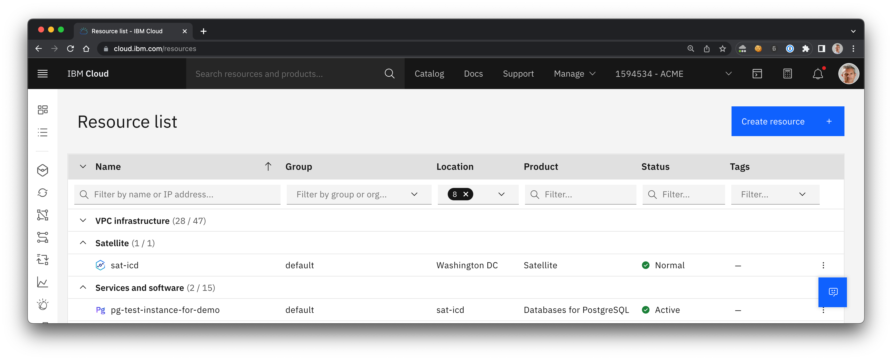

# IBM Cloud Database on top of IBM Cloud Satellite location on VPC using Terraform

> Estimated duration: 2+ hours

The `install-icd.sh` script will provision

* an IBM Cloud Satellite location
* an IBM Cloud VPC with 9 hosts
* an IBM Cloud Database (ICD) instance in this location that uses VPC block storage.

## Pre-requisites

* IAM API key with full access to Satellite, ICD services, VPC infrastructure and VPC block storage
* a working Terraform installation

### IBM Cloud API key

The script expects the API key in `TF_VAR_ibmcloud_api_key`, e.g. run 

```sh
export TF_VAR_ibmcloud_api_key=<API key>
```

before executing the `install-icd.sh` script.

### IBM Cloud VPC SSH key

Create an SSH key in IBM Cloud VPC named `<ssh key name>`.

> You need one in each region you want to provision to. For the example below make sure you've at least created one in us-east!

### Create terraform input variable file

Create a file named `<location name>.tfvars` (substitute your desired location name) in the root directory of the repo (same directory as `install-icd.sh` script).

The following values are required:
```terraform
location_name     = "<location name>"
is_location_exist = false
managed_from      = "wdc"
manage_iam_policy = true
region            = "us-east"
image             = "ibm-redhat-8-6-minimal-amd64-3"
existing_ssh_key  = "<ssh key name>"

control_plane_hosts = { "name" : "cp", "count" : 3, "type" : "bx2-8x32" }
customer_hosts      = { "name" : "customer", "count" : 3, "type" : "bx2-32x128" }
internal_hosts      = { "name" : "internal", "count" : 3, "type" : "bx2-8x32" }
```

- `location_name`: name of the location
- `is_location_exist`: if the location already exists before running this script, set this value to `true`
- `managed_from`: needs to be an IBM Cloud region that is supported by IBM Cloud Databases on Satellite
- `manage_iam_policy`: if the necessary IAM policies for the databases-for-* services already exist before running this script, set this value to `false`
- `region`: the IBM Cloud region in which to deploy all VPC VSI, networks, etc. - should ideally correspond to the region picked in `managed_from`
- `existing_ssh_key`: VPC SSH Key name - this needs to exist in `region`

## Installation

When running for the first time, execute (in the repo root):

```sh
terraform init
```

Then, trigger the installation script by running

```sh
./install-icd.sh <location name> <ICD service name> <pg-instance-name>
```

For example,

```sh
./install-icd.sh my-demo-location databases-for-postgresql pg-test-instance-for-demo
```

## Post Installation

Once all the components have been installed successfully, the [Resources list](http://cloud.ibm.com/resources) will be similar to



The [Satellite Location](https://cloud.ibm.com/satellite/locations) console will be similar to


The Posgres database service will be similar to


## Cleanup

1. Find all database instances running in the location

1. Soft-delete all of them from the Console or by running the command

    ```sh
    ibmcloud resource service-instance-delete <db-name>
    ```

    > A "normal" delete only does a soft-delete, then it takes 24/48h to automatically get hard-deleted.

1. Let's run a hard-delete straight-away after a soft-delete.

    ```sh
    ibmcloud resource reclamation-delete <db-name>
    ```

    You can see the open reclamations with

    ```sh
    ibmcloud resource reclamations
    ```

    The output will be similar to

    ```sh
    ibmcloud resource reclamations | grep postgres
    7e639021-42a1-43c1-907d-a8f8d5e80c8f   8fb0b3de-77ef-458f-8d86-8d823afafbdc   crn:v1:bluemix:public:databases-for-postgresql:satloc_wdc_cbcq5t9w0qrlalrv74cg:a/0b5a00334eaf9eb9339d2ab48f7326b4:8fb0b3de-77ef-458f-8d86-8d823afafbdc::   SCHEDULED        2022-07-25T14:24:12Z
    a02ec1eb-623e-46ec-8e7b-89ef1b0840c6   e2865b7c-ca7d-4fd7-ac4d-7135d3757f73   crn:v1:bluemix:public:databases-for-postgresql:satloc_wdc_cbcq5t9w0qrlalrv74cg:a/0b5a00334eaf9eb9339d2ab48f7326b4:e2865b7c-ca7d-4fd7-ac4d-7135d3757f73::   SCHEDULED        2022-07-25T14:24:17Z
    ```

1. Wait for the service cluster to be deleted from the location. It will take approximatively 5 minutes.

    

1. After deleting the ICD service, the hosts list will be similar to

    

1. Run the above terraform destroy command

    ```sh
    terraform destroy $1 -state ./statefiles/$1.tfstate -var-file=$1.tfvars
    ```
